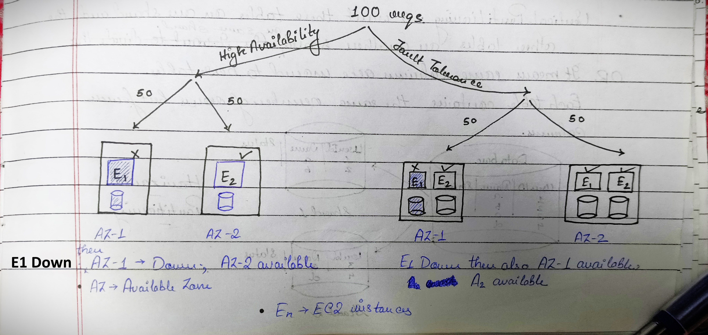
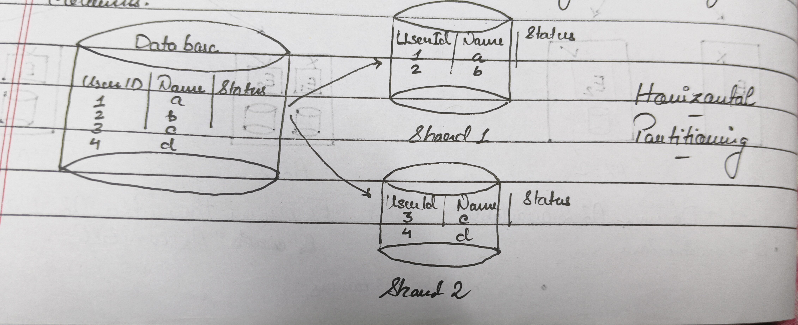
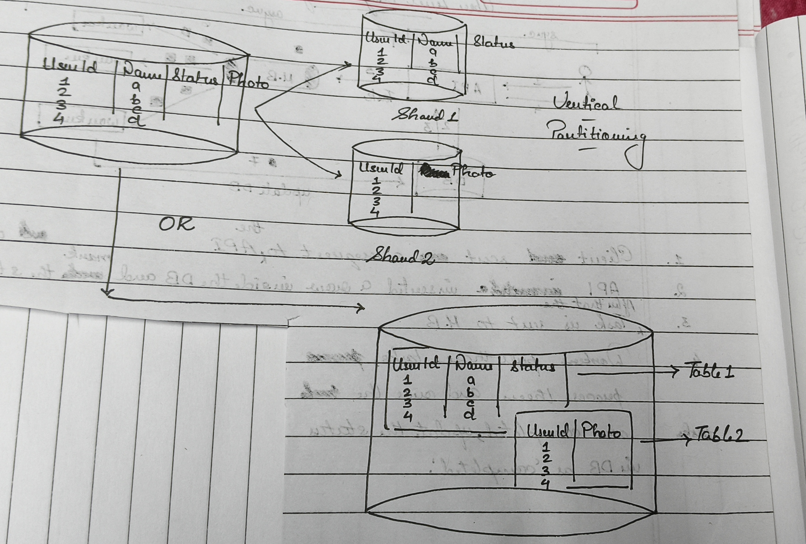
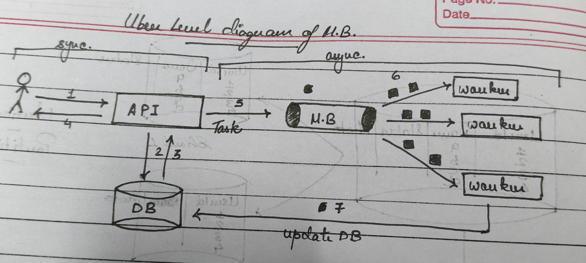
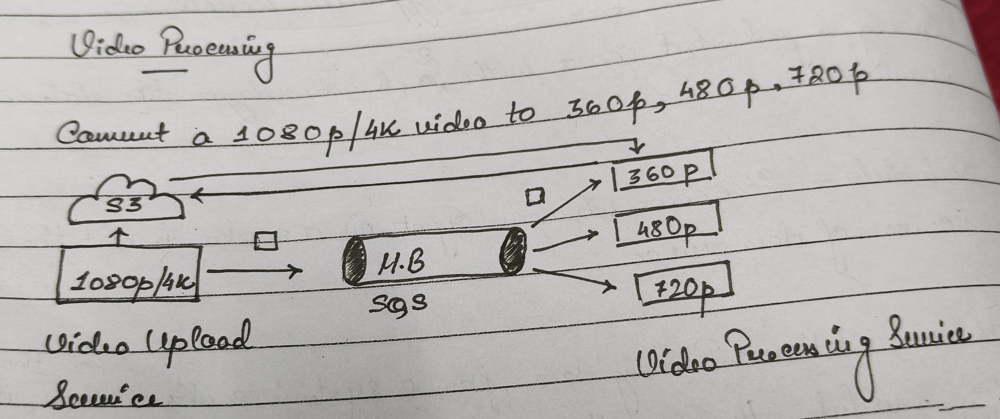
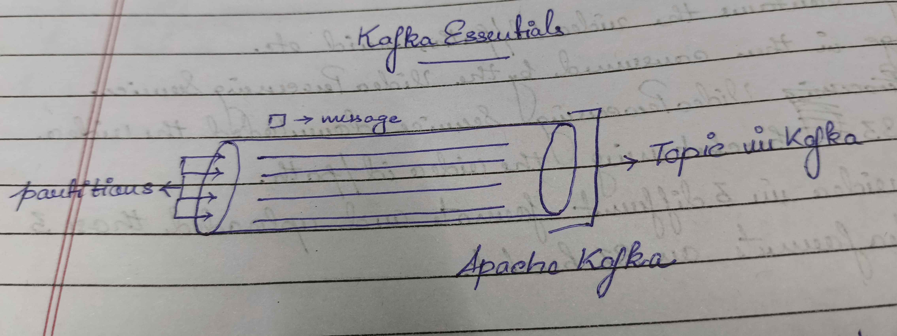
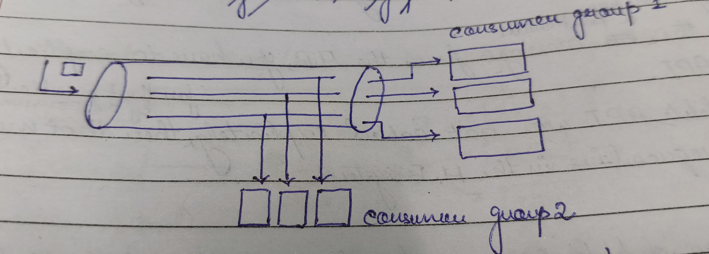

# Fault Tolerance v/s High Availability

App should continue running even if one machine or DB goes down. Use multiple machines to give you redundancy. One fails another take over.

Approach System 
```
- Big problem -> Top to Down Approach -> Divide the problem into small components/features
- Small Detailed Problem -> Down to Top Approach -> Start with DB design
```

- High Availability ensures your app to run 99.999% of the time. It's design ensures that the entire system can quickly recover even if one of it's component crashed.

- Fault Tolerance ensures zero downtime of your app. Complex design, higher redundancy to sustain any fault in one of it's component. Upgraded version of higher availability.




# Horizontal Partitioning v/s Vertical Partitioning
- Horizontal Partitioning: Within 1 table, I can pick some rows and put in one shard and put some other rows and put in another shard.

- Vertical Partitioning: I want these tables on one shard and the other tables on another shard or same shard. OR It means some columns are moved to new tables. Each table contains the same number of rows but fewer columns.





```
Note: Data are partitioned across different shards in such a manner that they don't have to implement cross-shard queries or across shard queries are expensive.
```

# Caching at Different Levels

Caching is good but comes with 2 disadvantages like staleness and invalidation.
- Stale data: It occurs when an object in a cache is not the most recent version of data source.
- Cache Invalidation: Removing data from a system's cache where that data is no longer valid or useful. you are getting eid of old or outdated cached content/data that is stored in cache. This ensures that the cache only contains relevant and up to date info. which can improve cache consistency and present errors.

# Message Brokers



1. Client sent a request to the API.
2. API inserted a row inside the DB and make the status as  `in progress` and sent a response to the client.
3. After that, the task is sent to the Message Brokers.
4. Workers pull those tasks, process them and once the tasks are completed, update the status in DB as `completed`.

## Example of Async. Processing

1. Video Encoding/Decoding.
2. massive Encryption/Decryption.
3. Uploading huge amount of files.

# Video Processing

Convert a 1080p/4k video to 360p, 480p, 720p



1. Video Upload Service uploaded a 1080p/4k video or the s3 bucket and triggered a message to Message Broker.
2. The message contains the video id/path, userId etc.
3. The message is then consumed by the Video processing Service.
4. The Video Processing Service downloaded the video from the S3 bucket using the video id/path.
5. Process the video in 3 different formats and uploaded those 3 different video formats on S3 bucket.

### Super advantage of Message Broker
- Brokers can requeue the message if not deleted.
Example:
- Consumer read the message but before it could delete it, the consumer service crashed.
- The message was consumed by the consumer, but the task was not processed.
- Brokers give you an API to delete a message explicitly from the Message Brokers.
- When the consumer service consumes the message from the Message Broker this does not means that the message has been deleted from the Message Broker.
- To delete a particular message from the Message Broker, you have to explicitly call the delete API.
- If the delete API was not called explicitly for that particular message by the consumer then that message will be again requeue in the Message Broker system.

### Disadvantage of Message Broker
- Message Broker requeue functions is the potential for message duplication. If a message is requeued due to an error failure, it could end up bring processed multiple times, leading to duplicate operations.

# Kafka Essentials



- Internally Kafka has topic and every topic has `n` partitions.
- The message is hashed and it knows it's partition.
- Hash function is deterministic that means that every time the value or input is hashed it will always give the same output.
- So all the events/messages for a particular userId will always go through that same particular partition(if the partitions of the topic is hashed based on the userId). [*Consistent hashing*]



- `N` Partitions means that I can have max `N` consumers of 1 group running. `(N+1)th` or `(N+2)th` consumers will not get any messages even if they are up and running.

- If the number of consumers in a Kafka consumer group is less than the number of partitions, some consumers will handle more than one partition.

- Suppose you have a topic with 3 partitions and a consumer group with 2 consumers.
    - Consumer 1: Handles Partition 0 & 1
    - Consumer 2: Handles Partition 2

- In Kafka, messages are not deleted in the traditional sense but are instead managed based on a  configuration retention policy.

- Messages are retained for a specific period and then deleted.

- Kafka does not delete the message based on whether they have been read or not. Instead, it relies on the concept of offsets to track consumption. Each consumer or consumer group commits offsets to Kafka indicating the position of the next message to read. This mechanism allows Kafka to manage message consumption efficiently without needing to delete messages based on their read status.

# Circuit Breakers

Cascading Failures: It can be defined as the process where one failure leads to successive failure of other elements in the grid.