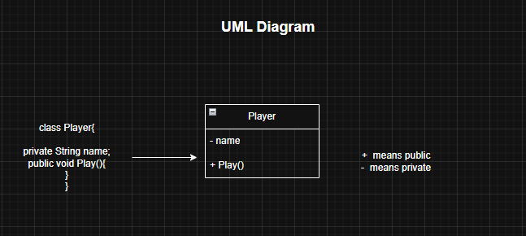
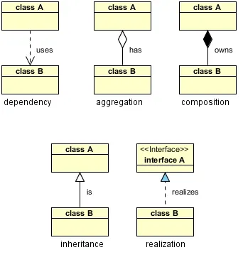

# IMPORTANT POINTs:

- Java auto-creates a default constructor ONLY when the class has no constructors at all.

- If you write ANY constructor (even one parameterized), Java will NOT auto-create a default constructor.

- Every time you create a child object, a parent constructor must run first.

- If the parent class has a default constructor, the child does not need to do anything. Java will automatically call the default constructor of the parent class from the child class. 

- If the parent class does NOT have a default constructor, then the child must call one of the parent’s parameterized constructors using super(...). This is compulsory; otherwise, Java cannot create the parent part of the object and it gives a compile-time error. 

- So, calling super(...) is optional only when the parent has a default constructor. Calling super(...) is mandatory when the parent has only parameterized constructors.

- Concrete means complete — fully implemented, not abstract.

- A concrete class is a regular class with all methods implemented.

- A concrete class can be instantiated (you can create objects of it).

- A concrete method has its full method body (not abstract).

- Concrete classes cannot contain unimplemented (abstract) methods.

- All classes that implement abstract methods or extend abstract classes must become concrete by providing all implementations.

- Static binding → compile-time → no polymorphism.

- Dynamic binding → runtime → polymorphism.

- Access Modifiers :: public → accessible everywhere | protected → class + package + subclass | default → class + package | private → only within the same class
- 
- UML Diagram Representation







- Association: Objects are related but can exist independently.

- Aggregation: A weak "has-a" relationship where the contained objects can exist independently.

- Composition: A strong "has-a" relationship where the contained objects cannot exist without the container.

- Inheritance: A subclass inherits from a superclass (is-a relationship).

- Dependency: One class depends on another for its functionality.

- Realization: A class implements the behavior defined by an interface.


```
S — Single Responsibility Principle (SRP)

A class should have only one responsibility and therefore only one reason to change.
This makes the code easier to understand, test, and maintain.

O — Open/Closed Principle (OCP)

Software entities should be open for extension but closed for modification.
New functionality should be added using inheritance or interfaces, without changing existing code.

L — Liskov Substitution Principle (LSP)

Objects of a derived class should be substitutable for objects of the base class without altering program correctness.
Subclasses must follow the behavioral contract of the parent class.

I — Interface Segregation Principle (ISP)

Clients should not be forced to depend on interfaces they do not use.
Large interfaces should be broken into smaller, role-specific interfaces.

D — Dependency Inversion Principle (DIP)

High-level modules should depend on abstractions, not concrete implementations.
Dependencies should be injected, promoting loose coupling and testability.
```
```
SRP → One responsibility
OCP → Extend safely
LSP → Substitute without breaking
ISP → Small interfaces
DIP → Abstractions over concretes
```
